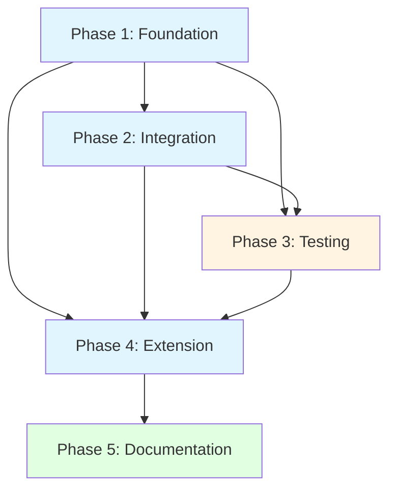

# Plan #1 Documentation Index
## Smart Project Selection for 'Check Syntax' Command

**Last Updated**: 2026-02-12

---

## 📋 Planning Documents

### Core Planning
- **[PLAN_SUMMARY.md](PLAN_SUMMARY.md)** - Start here! Executive summary and overview
- **[issue.md](issue.md)** - Complete Product Requirements Document (PRD)
- **[research.md](research.md)** - Technical research, analysis, and architectural decisions
- **[tasks.md](tasks.md)** - Master checklist for tracking progress (45 tasks total)

### Implementation Phases
- **[phase_1.md](phase_1.md)** - Foundation: Project Resolution Utility (8 tasks)
- **[phase_2.md](phase_2.md)** - Integration: Update compileBuffer Function (11 tasks)
- **[phase_3.md](phase_3.md)** - Testing: Unit and Integration Tests (8 tasks)
- **[phase_4.md](phase_4.md)** - Extension: Apply to Other Commands (10 tasks)
- **[phase_5.md](phase_5.md)** - Documentation and Finalization (8 tasks)

---

## 🚀 Quick Start Guide

### For Implementation Team

1. **Read First**: [PLAN_SUMMARY.md](PLAN_SUMMARY.md) - Get the big picture
2. **Understand Why**: [issue.md](issue.md) - Review requirements and user needs
3. **Understand How**: [research.md](research.md) - Review technical approach
4. **Start Building**: Follow phases in order:
   - Phase 1: Create project resolver utility
   - Phase 2: Integrate with compileBuffer
   - Phase 3: Write comprehensive tests
   - Phase 4: Apply to all commands
   - Phase 5: Complete documentation
5. **Track Progress**: Update [tasks.md](tasks.md) as you complete tasks

### For Code Reviewers

1. Review [issue.md](issue.md) - Understand the requirements
2. Review [research.md](research.md) - Understand architectural decisions
3. Review specific phase documents for implementation details
4. Verify all acceptance criteria met for each task

### For Project Managers

1. [PLAN_SUMMARY.md](PLAN_SUMMARY.md) - Timeline and status
2. [tasks.md](tasks.md) - Progress tracking (0/45 tasks complete)
3. Each phase document has estimated duration and dependencies

---

## 📊 Plan Statistics

| Metric | Value |
|--------|-------|
| **Total Phases** | 5 |
| **Total Tasks** | 45 |
| **Estimated Duration** | 32 hours (4-5 days) |
| **Complexity** | Medium |
| **Risk Level** | Low-Medium |
| **Test Coverage Target** | >90% |
| **Files to Create** | 1 new module |
| **Files to Modify** | 2 files (extension.ts, package.json) |
| **Commands Affected** | 6+ commands |

---

## 🎯 Success Criteria

### Must Have
- ✅ Auto-detection works for files within projects
- ✅ Default project validation prevents incorrect application
- ✅ Nested projects handled correctly
- ✅ Backward compatibility maintained
- ✅ All tests pass
- ✅ Documentation complete

### Should Have
- ✅ Test coverage >90%
- ✅ Performance <50ms overhead
- ✅ All commands updated consistently
- ✅ Clear logging for transparency

### Nice to Have
- Future enhancement: Status bar indicator
- Future enhancement: Project affinity cache
- Future enhancement: User preferences

---

## 📝 Document Purposes

### issue.md
**Purpose**: Product Requirements Document (PRD)  
**Audience**: All stakeholders  
**Content**: User stories, requirements, acceptance criteria, edge cases  
**When to Read**: Before starting any work

### research.md
**Purpose**: Technical analysis and architecture decisions  
**Audience**: Developers, architects  
**Content**: Codebase analysis, implementation approach, alternatives considered  
**When to Read**: During planning and design

### tasks.md
**Purpose**: Progress tracking  
**Audience**: Implementation team, project managers  
**Content**: Checklist of all 45 tasks across 5 phases  
**When to Update**: As tasks complete

### phase_1.md through phase_5.md
**Purpose**: Detailed implementation instructions  
**Audience**: Developers  
**Content**: Step-by-step tasks with exact code, validation, and acceptance criteria  
**When to Read**: While implementing that specific phase

### PLAN_SUMMARY.md
**Purpose**: High-level overview and quick reference  
**Audience**: Everyone  
**Content**: Executive summary, timeline, key decisions, next steps  
**When to Read**: First, and for quick status checks

---

## 🔄 Phase Dependencies



**Critical Path**: Phase 1 → Phase 2 → Phase 3 → Phase 4 → Phase 5

---

## 📂 Files That Will Be Created/Modified

### New Files
```
src/
  shared/
    projectResolver.ts           (NEW) - Core resolution logic

src/test/suite/
  projectResolver.test.ts        (NEW) - Unit tests
  compileBuffer.integration.test.ts  (NEW) - Integration tests
  README.md                      (NEW) - Test documentation

plans/plan_1/
  adr-001-smart-project-selection.md  (NEW) - ADR
  command-audit.md               (NEW) - Command analysis
  command-updates.md             (NEW) - Update documentation
  test-results.md                (NEW) - Test results
  user-announcement.md           (NEW) - Feature announcement
  release-notes.md               (NEW) - Release notes
```

### Modified Files
```
src/
  extension.ts                   (MODIFIED) - Multiple functions updated
  
CHANGELOG.md                     (MODIFIED) - Feature entry
README.md                        (MODIFIED) - Multi-project section
package.json                     (MODIFIED) - Version bump
```

---

## 🛠️ Tools and Commands

### Compilation
```bash
npm run compile
```

### Testing
```bash
npm test
npm test -- --grep "projectResolver"
```

### Debugging
```bash
# Run extension in debug mode (F5 in VS Code)
# Attach debugger to test process
npm run test:debug
```

---

## ✅ Validation Before Starting

Before beginning implementation, verify:

- [ ] All planning documents reviewed
- [ ] Requirements understood
- [ ] Technical approach agreed upon
- [ ] Team has necessary VS Code extension development knowledge
- [ ] Test workspace available for manual testing
- [ ] Development environment set up

---

## 📞 Support

**Questions about Requirements?** → See [issue.md](issue.md)  
**Questions about Implementation?** → See phase documents and [research.md](research.md)  
**Questions about Progress?** → See [tasks.md](tasks.md)  
**Questions about Timeline?** → See [PLAN_SUMMARY.md](PLAN_SUMMARY.md)

---

## 🎉 Plan Status

**Overall Status**: ✅ **READY FOR IMPLEMENTATION**

**Completeness**:
- ✅ Requirements analyzed
- ✅ Research completed
- ✅ Architecture decided
- ✅ Tasks defined (45 atomic tasks)
- ✅ Acceptance criteria specified
- ✅ Testing strategy defined
- ✅ Documentation planned
- ✅ No blockers identified

**Confidence**: High (9/10)

---

## 📅 Next Steps

1. **Team Review** - Review this plan with development team
2. **Approval** - Get approval to proceed
3. **Sprint Planning** - Schedule into sprint
4. **Implementation** - Begin with Phase 1
5. **Progress Tracking** - Update [tasks.md](tasks.md) regularly
6. **Completion** - Verify all acceptance criteria met

---

**Ready to start? Begin with [PLAN_SUMMARY.md](PLAN_SUMMARY.md) then proceed to [phase_1.md](phase_1.md)!**

---

*Last Updated: 2026-02-12*
